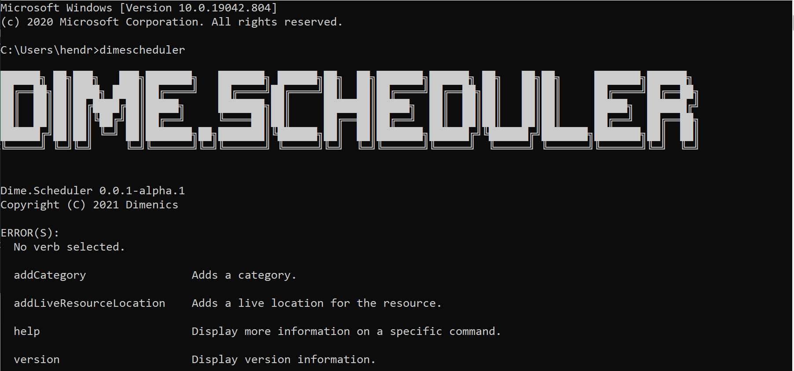
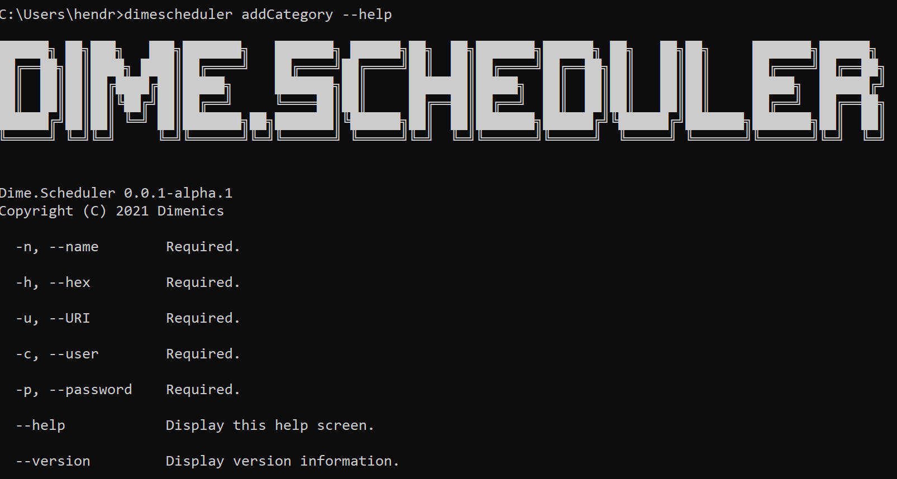

<p align="center">
    
</p>

<p align="center">
 
<a href="https://codeclimate.com/github/dimenics/ds-dotnettool/maintainability"></a> 
 <a href="https://github.com/dimenics/ds-dotnettool/discussions">
    
</a>
</p>
<h1 align="center">Dime.Scheduler .NET Tool</h1>

Connect with Dime.Scheduler through a .NET Tool.

## Installation

```cmd
dotnet tool install Dime.Scheduler.DotNetTool --global --version 0.0.1-alpha.latest
```

## Prerequisites

To clone and run this application, you'll need Visual Studio 16.7 or higher. The application is built with C# 9 and targets .NET 5.0.

## Usage

The following example adds or updates a category in Dime.Scheduler:

```cmd
dimescheduler addCategory
-u https://mydimescheduler.io
-c myadministrator@mydimescheduler.com
-p mystrongpassword
-n Service order status
-h #32a852
```

The entry point of the global tool is the `dimescheduler` command.



See the repo's wiki for a list of all commands and their parameters.

To see the parameters of a command, simply run the `dimescheduler` + `verb` + `--help` command and you'll get all the information you need:



## Contributing

We welcome contributions. Please check out the contribution and code of conduct guidelines first.

To contribute:

1. Fork the project
2. Create a feature branch (`git checkout -b feature/mynewfeature`)
3. Commit your changes (`git commit -m 'Add mynewfeature'`)
4. Push to the branch (`git push origin feature/mynewfeature`)
5. Open a pull request
